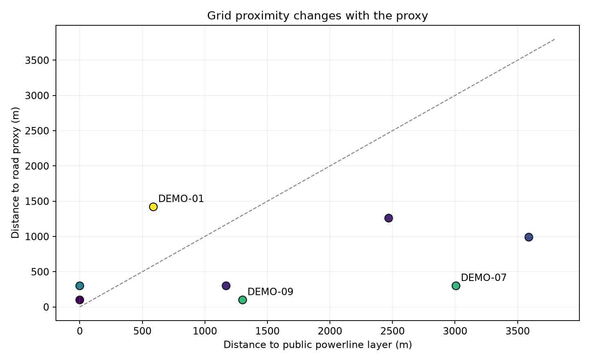

# Canterbury Solar Siting Screen

> This is a **screening** tool, not a development decision. It ranks candidate areas from open data so that a human can look at fewer of them. The single most important variable in a real solar project — available grid hosting capacity at a specific connection point — is not public at site level and is explicitly out of scope. Nothing here should be read as a statement about any particular parcel of land.

An auditable Python workflow for utility-scale fixed-tilt PV screening in Canterbury, New Zealand. It connects three decisions that are often analysed separately: where open data suggests land may be worth reviewing, how sensitive that ranking is to incomplete network data, and what a simplified solar output shape would have captured at the ISL0661 wholesale node.

[Open the interactive findings dashboard](https://kenchch.github.io/nz-solar-siting-screen/) · [Rule register](rules/rule_register.csv) · [Policy sources](rules/SOURCES.md) · [Data acquisition](data/README.md)



## Three findings

1. **Grid proximity is too uncertain to hide inside one score.** In the deterministic demonstration, only 2 of the top 4 candidates appear in both the LINZ powerline-layer ranking and the road-proxy ranking. The union contains 6 sites, so 4 are exclusive to one method (Jaccard index 0.333). This does not prove that roads are a better representation of the distribution network. It proves the open-data answer is method-sensitive and should become a `verify_grid` review flag.
2. **A single width proxy changes the screening answer.** The 180 m inward-buffer test is the S-02 baseline; `2A/P` remains beside it as an audit comparator. The deterministic geometry stress case is a 200 × 200 m square: the core test passes while `2A/P` reports 100 m and fails. The run manifest reports the number of disagreements instead of hiding this modelling choice.
3. **Generation is not revenue — but the signal is not a simple straight-line decline.** Official Electricity Authority half-hourly final prices at ISL0661 produce annual solar-shape capture rates from **74.8% to 109.0%** over 2019–2025. Five of seven annual values are below 100%; 2019 and 2023 are above it. The strongest discount is 2024 at **74.8%**. The honest conclusion is volatility and timing risk, not a claimed monotonic cannibalisation trend.


The 2025 Electricity Authority December source file is explicitly labelled `incomplete`; 2025 has 17,472 observations rather than a normal 17,520. It is retained with that provenance visible and must not be presented as a final full-year statistic without rechecking the source.

## Scope and decision logic

| Rule | Treatment | Baseline implementation |
|---|---|---|
| S-01 contiguous area | Exclude | at least 20 ha |
| S-02 usable width | Exclude | 180 m inward-buffer core; retain `2A/P` as comparator |
| S-03 land cover | Exclude | configured LCDB whitelist |
| S-04 public conservation land | Exclude | no intersection |
| S-05 highly productive land | **Flag** | LUC 1–3 → consenting review; never automatic exclusion |
| S-06 grid proximity | Rank + flag | nearest public powerline and nearest-road proxy, both retained |
| S-07 solar resource | Rank | higher LENZ mean annual solar radiation ranks better |
| S-08 slope | Optional | not in baseline; requires DEM processing |

Excluded records are written to `quarantine.gpkg` with the rule IDs that removed them. A configurable reject-rate gate aborts output when a batch looks more like a wrong input or CRS than a plausible screen.

Not covered: connection-point hosting capacity, voltage, connection cost, land ownership, parcel negotiation, geotechnical conditions, flood and wildfire risk, glare, ecology beyond the public-conservation overlay, archaeology, landscape/visual effects, mana whenua values, local plan rules, network losses, curtailment or construction access.

## Policy treatment: LUC 1–3 is not a veto

The source register was rechecked on 13 September 2026. The current instrument is the **NPS-HPL 2022 consolidated with December 2025 amendments**, effective 15 January 2026. Clause 3.9(2)(j)(i) provides a pathway for specified infrastructure where there is a functional or operational need; clause 3.9(3) requires loss of productive capacity and reverse-sensitivity effects to be minimised or mitigated. Before operative regional mapping, clause 3.5(7) also makes the transitional definition more specific than “all LUC 1–3”.

This dataset only supplies LUC class, not the full planning test. S-05 is therefore a conservative screening **flag** and a prompt for a planner, not a legal conclusion. See [rules/SOURCES.md](rules/SOURCES.md) for the primary text.

## Method

### M1 — siting

All metric work is rejected unless the input CRS is EPSG:2193 (NZTM2000). Geometry rules are evaluated first; failed records are quarantined rather than deleted. Surviving features retain both grid distances, their two ranks, absolute rank shift, HPL flag and solar rank. The composite score is for review ordering only.

### M2 — output shape

The model calculates positive solar elevation for each half hour at latitude −43.55°, raises it to a documented shaping exponent, and scales the annual mean to the configured 17.5% capacity factor. It is a typical clear-sky timing proxy — not measured generation and not a weather model. It excludes cloud, snow, horizon shading, degradation, tracking and inverter clipping.

All publication assumptions live in [`config/assumptions.yml`](config/assumptions.yml). Capacity-factor scaling is an invariant because the scalar cancels from capture rate. The actual sensitivity run varies the timing-shape exponent from 1.0 to 1.3; this changes the concentration of daytime output and therefore the measured capture-rate range.

### M3 — capture rate

For half-hour periods `t`:

```text
capture_rate = sum(price_t × output_t) / (sum(output_t) × mean(price_t))
```

The numerator is the output-weighted spot-market value. The denominator is the value the same energy would receive at the all-hours mean nodal price. A flat output profile is an invariant control and must return exactly 1.0; the test suite enforces it. Trading date and trading period are converted to unique UTC instants using `Pacific/Auckland`: 46-period and 50-period daylight-saving days therefore align one-to-one. The merge is validated as one-to-one, preserves the input row count, and fails on duplicate or unmatched keys.

This is a **market-value signal, not a revenue forecast**. It uses nodal spot prices, not a PPA, and excludes loss factors, node-to-node basis, FTRs, hedges and dispatch/curtailment constraints.

## Reproduce

Python 3.11+ is required.

```bash
python -m venv .venv
.venv/bin/pip install -e ".[dev]"
.venv/bin/python scripts/reproduce.py --demo
.venv/bin/python -m pytest
```

On Windows use `.venv/Scripts/` in place of `.venv/bin/`. To refresh the public market input, run `scripts/download_ea_prices.py`; LRIS and LINZ exports require the accounts/API keys described in [data/README.md](data/README.md).

## Outputs

- `outputs/demo/candidates.gpkg` — candidate-review features with every rule, flag and distance column
- `outputs/demo/quarantine.gpkg` — excluded features and violated rule IDs
- `outputs/demo/site_cards/` — top-three map cards (demo geometry; no aerial claim)
- `outputs/demo/figures/` — proxy comparison and capture-rate figures
- `outputs/demo/capture_rates.csv` — annual ISL0661 results and flat-profile control
- `outputs/demo/shape_exponent_sensitivity.csv` — timing-shape sensitivity at exponents 1.0, 1.15 and 1.3
- `outputs/demo/run_manifest.json` and `findings.json` — machine-readable provenance and dashboard payload

## Demo versus real data

The committed spatial outputs are deliberately marked `DEMO`: deterministic NZTM geometries exercise every code path without redistributing portal-controlled datasets or making parcel claims. They are not Canterbury candidate parcels. Replace them with the documented LRIS/LINZ/DOC layers to make a real-data run, then complete aerial review with a LINZ Basemaps key.

The market series is different: it is derived from official Electricity Authority monthly final-price CSVs downloaded on 13 September 2026 and filtered to ISL0661. The compact, gzip-compressed filtered series is committed so CI can reproduce every published result without a live network dependency; full monthly source files remain excluded.

## Validation

Thirty automated tests cover the CRS gate, exclusion and flag rules, both width methods, spatial-indexed nearest distance, the reject-rate gate, 46/48/50-period days, UTC uniqueness, merge row conservation, duplicate and unmatched keys, output-shape sensitivity, zero-output rejection, and the flat-output invariant. GitHub Actions runs the complete demo pipeline, strictly diffs CSV/JSON, compares GeoPackages by fields and geometry, and applies a bounded pixel-difference check to figures so platform metadata cannot mask or fabricate a result change.

## Licence and attribution

Code is MIT licensed. Source datasets retain their publishers' licences and attribution requirements. Do not redistribute LRIS, LINZ, DOC or Electricity Authority source files without checking the applicable item terms.
