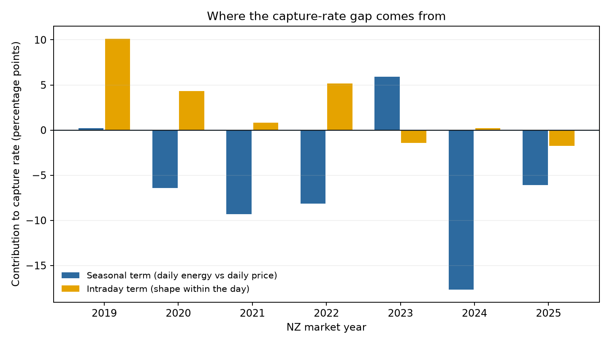
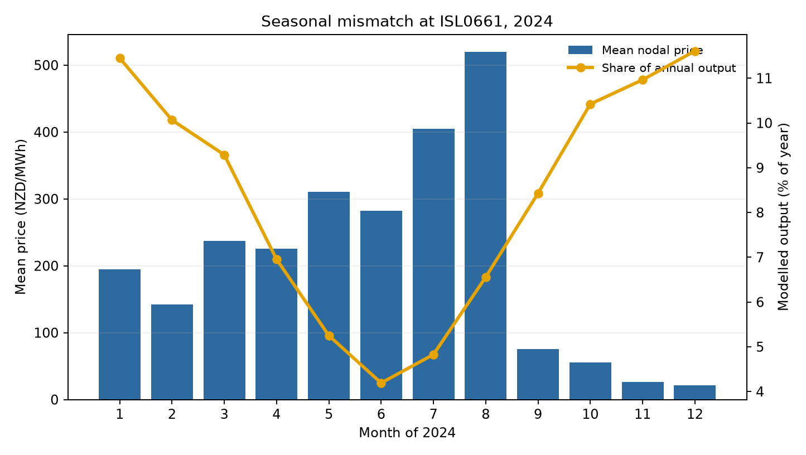
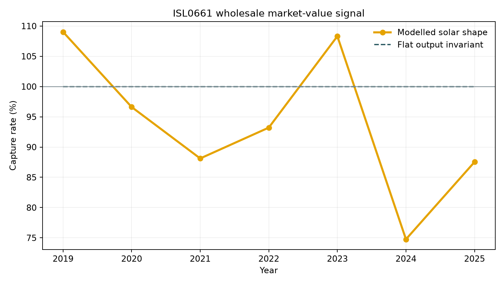
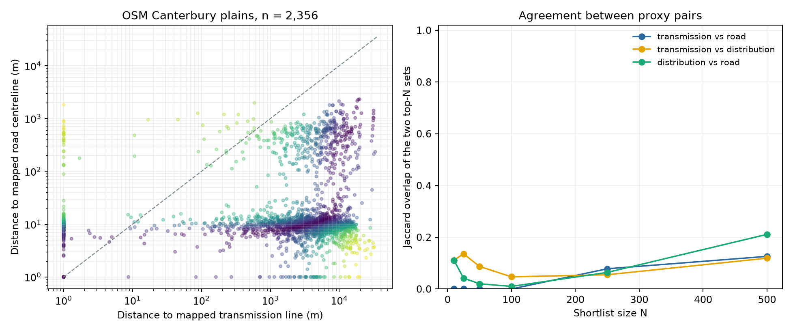

# Canterbury Solar Siting Screen

> This is a **screening** tool, not a development decision. It ranks candidate areas from open data so that a human can look at fewer of them. The single most important variable in a real solar project — available grid hosting capacity at a specific connection point — is not public at site level and is explicitly out of scope. Nothing here should be read as a statement about any particular parcel of land.

An auditable Python workflow for utility-scale fixed-tilt PV screening in Canterbury, New Zealand. It answers three questions that are usually analysed separately: where open data suggests land may be worth reviewing, how sensitive that ranking is to incomplete network data, and what a simplified solar output shape would have captured at the ISL0661 wholesale node.

They are **reported side by side, not integrated**, and the seams are worth naming. `screen_score` uses solar resource and usable area only, so the capture-rate work has no influence on the site ordering. And the market analysis is one node at one latitude: a candidate that would connect somewhere other than ISL0661 is being shown a Christchurch-flavoured price signal, not its own. Giving each candidate its own nodal value is the obvious next step and is not done here.

[Open the interactive findings dashboard](https://kenchch.github.io/nz-solar-siting-screen/) · [Rule register](rules/rule_register.csv) · [Policy sources](rules/SOURCES.md) · [Data acquisition](data/README.md)



## Two empirical findings, two method warnings

1. **Empirical — generation is not revenue, and the reason is seasonal, not midday cannibalisation.** Official Electricity Authority half-hourly final prices at ISL0661 give apparent-solar-time capture rates from **82.5% to 110.3%** over 2019–2025 for a north-facing 25° array. Five of seven annual values are below 100%; 2019 and 2023 are above it. The worst year is 2024 at **82.5%**, a gap of 17.5 points below the time-average price. The decomposition below attributes **−17.7 points of it to seasonal mismatch**; the intraday term is **+0.2 points**, so the shape of the day actually gave a little value back. The discount is dry-year winter prices arriving when a fixed-tilt array produces least, not midday price suppression.
2. **Empirical — a road proxy tracks the low-voltage network, and its usefulness falls monotonically with voltage.** Spearman rank correlation between distance-to-road and distance-to-network, on **10,684 real Canterbury cadastral units**: **0.57** for ≤22 kV distribution, **0.38** for the 33–66 kV tier a project actually connects at, **0.045** for ≥110 kV transmission, **0.023** for the LINZ Topo50 powerline layer. The ordering is the finding and it holds on a second, differently-built population. The magnitudes do not — see [the correction](#correction-the-1-of-the-variance-figure-was-population-specific). Roads find the poles that are everywhere and say almost nothing about the connection that matters. This is why both distances and a `verify_grid` flag stay visible and why grid distance was removed from `screen_score` entirely. See [the OSM study](#measuring-the-grid-proxy-disagreement-on-real-geometry) for the caveats, which are substantial.
3. **Method warning — the screen was missing terrain and water, and an aerial check is what found it.** Of the twenty largest grid-proxy disagreements, **11 are not developable land at all** — coastal barrier spit, wetland margin, or 14–24° peninsula slope. None is a grid problem. S-08 slope was documented as "not implemented" and there was no water or coastal rule at all; all three now exist, built from free inputs, and on that sample they **exclude 8 of the 11, flag 2 more, and miss 1**. On a **held-out** second sample of twenty they reach 3 of 5, miss 2 — both land-use failures that only real land-cover data can catch — and wrongly exclude 1 good site over a farm irrigation pond. Those samples were selected on disagreement, so neither failure rate is a population rate.
4. **Method warning — a single width proxy changes the screening answer.** The 180 m inward-buffer test is the S-02 baseline; `2A/P` remains beside it as an audit comparator. The deterministic geometry stress case is a 200 × 200 m square: the core test passes while `2A/P` reports 100 m and fails. The run manifest reports the number of disagreements instead of hiding this modelling choice.

## Seasonal or intraday? The capture rate splits exactly

Writing each half hour's price as its daily mean plus a within-day residual makes the capture rate separate into two terms that sum to it with no remainder:

```text
capture_rate = seasonal_term + intraday_term
             = sum_d(n_d · P_d · G_d) / D   +   sum_d(n_d · cov_d) / D
```

where `P_d` and `G_d` are day `d`'s mean price and mean output, `cov_d` is the within-day price/output covariance, and `D = sum(output) × mean(price)`. The seasonal term answers *is the output in the expensive months?* The intraday term answers *is it in the expensive hours?* **Only the intraday term is price cannibalisation.** `tests/test_capture_decomposition.py` asserts the identity holds, that a purely seasonal price signal puts nothing in the intraday term, and that an artificial midday trough puts nothing in the seasonal term.

| NZ market year | Solar capture | Seasonal term | Intraday term (pts) | Metered load control |
|---:|---:|---:|---:|---:|
| 2019 | 110.3% | 100.2% | +10.1 | 102.9% |
| 2020 | 97.9% | 93.6% | +4.3 | 108.0% |
| 2021 | 91.5% | 90.7% | +0.8 | 105.5% |
| 2022 | 97.0% | 91.9% | +5.1 | 105.3% |
| 2023 | 104.5% | 105.9% | −1.4 | 102.1% |
| 2024 | 82.5% | 82.3% | +0.2 | 114.2% |
| 2025 | 92.2% | 93.9% | −1.7 | 102.2% |

The intraday term is **positive in five of seven years** and averages **+2.5 points** (2025 is a partial market year — 17,472 of a normal 17,520 periods — and is included in that mean; over the six complete years it is +3.2): the modelled solar shape currently earns a small premium *within* the day, because daytime is worth more than the overnight trough and New Zealand has almost no solar on the system yet. Reading these annual numbers as cannibalisation would be wrong.

2019 stands out at **+10.1 points**, four times the period average, and it is worth saying why. The intraday term is the output-weighted within-day price premium divided by the annual mean price, and 2019 had a large numerator over a small denominator. It is the only year in the series whose average midday block was the most expensive part of the day — 126 NZD/MWh at 10:00–16:00 against 121 in the 17:00–21:00 evening and 94 overnight — which gives a solar-weighted premium of **+11.7 NZD/MWh**, the largest in absolute terms of the seven years. It was also the second-cheapest year overall at a 116 NZD/MWh annual mean.

The contrast is 2021 and 2025, where the same calculation returns +0.8 and −1.7 points: their annual means were lifted by scarcity concentrated in the **evening** peak (210 and 169 NZD/MWh at 17:00–21:00, against 166 and 152 at midday), which a solar shape cannot reach. So 2019 is a statement about the shape of that year's day, not a sign that solar earns a premium.

What the series shows is a seasonal mismatch, and 2024 makes it visible:



August 2024 averaged **520 NZD/MWh** during the gas and hydro squeeze while the modelled array delivered 6.6% of its annual output; December averaged **21 NZD/MWh** against 11.6% of output. The 2024 half-hourly averages have no material midday trough at all — the cheapest hours of that year were overnight, not at noon.

The December collapse is worth reading carefully, because it is the seasonal term's future in miniature. A 21 NZD/MWh monthly average is not a solar effect: it is a wet spring filling the South Island lakes into a low-demand month, so hydro spills and the market clears near zero for weeks. Summer is already the cheapest part of this market before any material PV exists. **Adding solar makes the seasonal term worse, not just the intraday one** — new summer-peaking capacity arrives in the months that are already oversupplied, deepening exactly the months where a fixed-tilt array puts most of its energy. A penetration forecast that only models midday cannibalisation will miss the larger half of the effect.

The two terms therefore call for different responses. The intraday term is a penetration question and the thing to forecast half-hourly. The seasonal term is a technology and contracting question — tilt, east–west orientation, storage duration, and how much winter-weighted hedge sits behind the asset.

### Control group: the real load shape at the same node

A flat profile is an arithmetic invariant that must return exactly 1.0, not a comparison. The Electricity Authority publishes metered grid-exit energy at ISL0661, so the local demand shape runs through the identical calculation as a genuine control. It captures **102.1%–114.2%**, above 1.0 in every year, with a positive intraday term every year (evening peak) and a seasonal term that peaks in the same dry winter that hurts solar most. That is the mirror image of the solar result and is why "generation is not revenue" is a statement about timing rather than about PV.



## Two model errors found and quantified

### 1. Tilt: the output model was labelled fixed-tilt but the geometry was horizontal

The earlier model used `sin(elevation)^1.15`, which is a horizontal-plane proxy, while every document called the asset a fixed-tilt array. It produced a December/June output ratio of **5.85×**; a north-facing 25–30° array in Canterbury is roughly 2.5–3×. Because this node prices winter so highly, an overstated seasonal swing systematically **understated** the capture rate — the error pushed directly against the headline number.

The corrected model is the cosine of the incidence angle on a north-facing plane tilted `tilt_deg` from horizontal, multiplied by a clear-sky beam transmittance (Kasten–Young air mass, Meinel transmittance) raised to the shaping exponent. Geometry carries the array orientation; transmittance carries the longer atmospheric path that weakens low winter sun. `tilt_deg: 0` recovers the horizontal plane exactly, so the old model is still runnable as a comparator.

| Array tilt | Dec / Jun output | Mean capture | Worst year | Mean seasonal | Mean intraday (pts) |
|---:|---:|---:|---:|---:|---:|
| 0° (old horizontal proxy) | 5.85× | 92.9% | 71.9% | 89.7% | +3.2 |
| **25° (baseline)** | **2.77×** | **96.6%** | **82.5%** | **94.1%** | **+2.5** |
| 35° | 2.25× | 97.7% | 86.0% | 95.5% | +2.3 |

> The horizontal-plane error was worth **7.1 percentage points** on the worst year (71.9% → 82.5%) and 3.7 points on the period mean. It moved the headline in the direction that flattered the "solar is badly discounted" story, which is exactly the direction an error is easiest not to notice.

Related, and much smaller: output is now evaluated at the **midpoint** of each trading period rather than at its opening instant, removing a systematic 15-minute lead. `midpoint_utc` is published beside `timestamp_utc` so the basis is auditable, and the join key is unchanged.

### 2. Civil clock versus solar time

The earlier model also placed solar noon at 12:00 on the civil clock, including during NZDT. The corrected model converts each UTC instant to local time, then adjusts its hour angle for longitude, UTC offset and the equation of time. The January peak moves from 12:00 to 13:30 NZDT in the half-hour model.

| NZ market year | Civil-clock model | Corrected apparent-solar model | Change (percentage points) |
|---:|---:|---:|---:|
| 2019 | 110.66% | 110.35% | −0.31 |
| 2020 | 98.50% | 97.91% | −0.59 |
| 2021 | 92.23% | 91.49% | −0.74 |
| 2022 | 97.36% | 97.00% | −0.36 |
| 2023 | 105.05% | 104.52% | −0.53 |
| 2024 | 82.28% | 82.53% | +0.25 |
| 2025 | 92.09% | 92.16% | +0.07 |

> Maximum annual shift 0.74 percentage points. Unlike the tilt error, this one was real but immaterial to the conclusion; both are reported at their actual size rather than at the size that makes a better story.

### Observation-year reconciliation

`capture_rates.csv` groups by **New Zealand market year** after converting UTC timestamps to `Pacific/Auckland`, not by the year printed at the start of the UTC timestamp. All 122,688 input rows are assigned exactly once, and the pipeline asserts that `sum(observations) == len(price input)`.

| Year label | Rows grouped by UTC year | Rows grouped by NZ market year / reported observations |
|---:|---:|---:|
| 2018 | 26 | 0 |
| 2019 | 17,520 | 17,520 |
| 2020 | 17,568 | 17,568 |
| 2021 | 17,520 | 17,520 |
| 2022 | 17,520 | 17,520 |
| 2023 | 17,520 | 17,520 |
| 2024 | 17,568 | 17,568 |
| 2025 | 17,446 | 17,472 |

The 26 UTC rows dated 2018-12-31 are the first 13 NZDT hours of market year 2019. Likewise, the NZ market-year count for 2025 includes its first 26 rows from 2024 UTC. The 2025 Electricity Authority December file is explicitly labelled `incomplete`; on the market-year basis, 2025 has 17,472 observations rather than a normal 17,520. It remains unsuitable for presentation as a final full-year statistic without rechecking the source.

## Measuring the grid-proxy disagreement on real geometry

The demo run answers "does the code work" on twelve deterministic rectangles; a Jaccard index on n = 4 is not evidence about anything. LINZ Topo50 and LCDB both need portal accounts, so `scripts/osm_grid_study.py` runs the same comparison on an open substitute with real geometry: **9,102 OpenStreetMap farmland polygons** in the Canterbury plains, of which **2,356 pass S-01 (20 ha) and S-02 (180 m width core)**, against **21,842 road centrelines** and every mapped power line in the extract.

Only the two geometric rules are applied. Land-cover class, LUC class and solar resource still need LRIS, so this is a grid-distance study, not a screening run.

### Split the network by voltage, not by OSM tag

An earlier version of this study split power lines by their OSM `power` tag, which is the wrong cut. The tag separates 131 ways tagged `line` at 66 kV from 158 ways tagged `minor_line` at the same 66 kV, while lumping 220 kV transmission and 350 kV HVDC in with the first group. A Canterbury project of tens of megawatts connects at **33 or 66 kV**. It does not connect to an HVDC pole, and a 220 kV connection is a different project with a different budget. Tiering by voltage puts each way where the engineering puts it; ways tagged with two circuits such as `66000;11000` take the higher one, HVDC is dropped outright, and the 994 untagged ways are reported rather than silently assigned.

| Voltage tier | Mapped ways | Median distance | 90th percentile | Rank correlation with road distance |
|---|---:|---:|---:|---:|
| ≥110 kV transmission | 65 | 4,864 m | 15,055 m | **0.04** |
| **33–66 kV (connection tier)** | **541** | **1,687 m** | **6,066 m** | **0.11** |
| ≤22 kV distribution | 5,134 | 13 m | 548 m | **0.47** |
| road centrelines | 21,842 | 10 m | 450 m | — |



### Correction: the "1% of the variance" figure was population-specific

Everything in this section was computed on the OpenStreetMap farmland
population. Re-running it on the cadastral units — same rules, same networks,
a differently-built set of polygons — moves the connection-tier number a long
way:

| Network basis | ρ on OSM farmland (n = 2,356) | ρ on parcel units (n = 10,684) |
|---|---:|---:|
| ≤22 kV distribution | 0.478 | 0.570 |
| **33–66 kV connection tier** | **0.108** | **0.379** |
| ≥110 kV transmission (OSM) | 0.040 | 0.045 |
| ≥110 kV transmission (Transpower) | 0.043 | 0.026 |
| LINZ Topo50, no voltage | 0.038 | 0.023 |

The **ordering survives** — road proximity is most informative about the
lowest-voltage network and least informative about the highest, on both
populations. The **magnitude does not**: on real cadastral units a road proxy
explains about **14%** of the variance in connection-tier distance, not 1%.

So the sentence "explains about 1% of the variance" was true of the population I
measured and not of the one a developer would actually screen. The OSM farmland
set is dominated by large unimproved blocks on the spit and the peninsula, where
roads and subtransmission have no common cause; cadastral units concentrate on
the plains, where both follow the same settlement pattern. Fourteen per cent is
still nowhere near a substitute for knowing where the 33–66 kV network is, but it
is an order of magnitude more than I had been claiming, and the claim as
published was wrong.

The ordering below is the finding, and it is monotonic in voltage. A road centreline is a good stand-in for the low-voltage network — of course it is, the poles follow the road — and a steadily worse one as the voltage rises. Stated on the population a developer would actually screen:

> **Cadastral units, n = 10,684.** Road distance against 33–66 kV distance: Spearman ρ = **0.379**, 95% CI **[0.363, 0.395]**, p < 10⁻³⁰⁰, explaining **14.3%** of the variance. Against ≤22 kV distribution: ρ = **0.570**. Against ≥110 kV transmission: ρ = **0.045**.

So a road proxy carries real information about where the low-voltage network is, appreciably less about the tier a project connects at, and effectively none about transmission. Fourteen per cent is not nothing and it is not a substitute: it leaves 86% of the variation in connection-tier distance unexplained, which is the part that decides a project. The comparison publishes rho, the p-value, the confidence interval and the variance explained together, computed with `scipy.stats.spearmanr`, so that no half of that sentence can be quoted without the others.

The 33–66 kV tier is also not a stand-in for transmission (ρ = 0.31 between those two), so there is no single "distance to the grid" number to put in a score.

**If you take one sentence to an interview:** on real Canterbury cadastral units, distance to a road explains about **14%** of the variance in distance to the 33–66 kV network, and the figure falls monotonically with voltage — 0.57 for ≤22 kV, 0.38 for 33–66 kV, 0.045 for ≥110 kV — an ordering that holds on two independently built populations. A road proxy tells you where the low-voltage poles are, not where you could connect.

### The verify flag had to be re-cut too

`S06_verify_grid` originally fired when *any* proxy distance exceeded 5 km, or the rank shift reached 3. Applied to these columns that rule flags **2,348 of 2,356 sites**, and the notebook recomputes it beside the new one — a flag that fires on everything carries no information. It now tests one thing: distance to the connection tier against that tier's own review distance, which is configured per tier in `config/assumptions.yml`. At 5 km from 33–66 kV it flags **372 of 2,356 (15.8%)**, which is a queue a person can actually work through.

The absolute rank-shift trigger was dropped from the flag entirely. `rank_shift_review = 3` was chosen against eight demo fixtures; at n = 2,356 the median shift is 646, so the same constant fires on essentially every site. Rank thresholds expressed in ranks do not transfer across sample sizes. The shift stays published as a column, and it still selects the aerial review queue.

### Three line layers, side by side

`scripts/grid_basis_comparison.py` measures every candidate against three public
answers to "where is the grid", and **never merges them**. Merging would destroy
`grid_basis`, the column that records which question a distance answered.

| Layer | Features | Length | Voltage attribute | Median distance | ρ with road |
|---|---:|---:|---|---:|---:|
| LINZ Topo50 powerlines | 347 | 1,889 km | **none** | 2,087 m | 0.038 (p = 0.06) |
| OpenStreetMap, all | 6,738 | 8,695 km | yes | — | — |
| Transpower ≥110 kV | 11 | 2,382 km | yes | 4,810 m | 0.043 |

**I expected Topo50 to behave like an all-voltages layer and it does not.** The
hypothesis going in was that an undifferentiated layer would track roads more
closely than the 33–66 kV tier, since it would be dominated by the low-voltage
network that follows the road. The opposite is true: Topo50's correlation with
road distance is 0.038 on the OSM population — **not distinguishable from zero**
at p = 0.06 — and 0.023 on the cadastral one.

The reason is more useful than the hypothesis was. Topo50 maps **1,889 km of
line where OpenStreetMap maps 8,695 km**, and its median distance and its road
correlation both sit with the transmission tier rather than the distribution
one. It is not an all-voltages layer that lacks a voltage field. It is
effectively a transmission-and-subtransmission layer that does not say so. A
screen built on it while calling the result "distance to the grid" is silently
answering the transmission question — which is the wrong question for a project
connecting at 33 or 66 kV, and harder to notice than a road proxy being wrong.

**How complete is OpenStreetMap's transmission mapping?** Transpower's own
layer is authoritative for the national grid, so it can be used as a yardstick:
of the **1,571 km** of commissioned Transpower line in the study area, OSM has a
transmission line within 250 m of **1,040 km — a recall of 66%**. A screen built
on OSM alone is missing a third of the national grid by length here. That is
measured rather than asserted, and it is why the two are published side by side.

The three verify flags agree with each other on 59–81% of sites depending on the
pair, which is another way of saying the same thing: the layer you choose is a
modelling decision, not a detail.

**Below 33 kV there is no authoritative open vector at all.** Orion and EA
Networks publish no distribution geometry, so the ≤22 kV tier rests entirely on
OpenStreetMap and cannot be validated the way the transmission tier just was.

### Aerial review: 11 of the 20 worst disagreements are not developable land

All twenty of the largest connection-tier-versus-road disagreements were checked against LINZ Basemaps aerial imagery. Every verdict in [`data/aerial_review_log.csv`](data/aerial_review_log.csv) carries the date, the imagery and zoom used, **the image it was written from** (committed under [`data/aerial/`](data/aerial/)), and an `observed_detail` naming something visible in that image — an aircraft parked on a grass airstrip, a sand island in the lagoon, the distance to a surf line. A reader can open the picture and contradict the verdict; that is the point.

> **Who reviewed these.** Three passes, recorded separately in the log. An AI agent (Claude Opus 5) made a first pass and **a second pass with the same tooling** — same agent, same images, so it is a re-read rather than an independent opinion — and the repository author then reviewed all twenty and confirmed them on 13 September 2026 (`author_confirmed_on`). The independent checks are the author's confirmation and the measured geometry: distances in the log are computed from the polygons, not estimated off a picture. The verdicts are a human-confirmed screening judgement from aerial imagery, not a site visit or a signed technical assessment.
>
> The second pass earned its keep. It confirmed all twenty verdicts but found two errors of my own making: the first pass had recorded the mosaic as "about 1.7 km across" when 1.7 km is the *per-tile* width at this latitude and the 3 × 3 mosaic is **5.3 km**, so every distance eyeballed off an image was roughly three times too small. Those are now measured from the geometry instead of estimated by eye. It also corrected one description — a site called an "enclosed valley floor" whose polygon turns out, at 23.8° mean slope, to be mostly the steep valley sides.

**Eleven of the twenty are not developable land at all**, and none of the failures is a grid problem:

| Group | Sites | What the imagery shows |
|---|---:|---|
| Coastal barrier spit | 5 | Gravel, dune and lagoon-margin flats between a lagoon and the open coast; one is bare dune with a formed track along it. |
| Lagoon and wetland margin | 1 | Low-lying marsh at the lake edge with standing water inside the polygon. |
| Peninsula slope | 4 | Steep coastal hillsides and cliffed headlands; measured mean slope 14–24°. |
| Enclosed valley floor | 1 | Flat (3.5° mean) but boxed in by steep slopes behind a settlement, under 400 m wide. |

The last row is a correction the data made to an eyeball grouping: five of these sites looked like "peninsula slope" in the imagery, but once slope was actually measured, one of them is a flat valley floor that fails for enclosure and size rather than gradient. It is the kind of thing a rule catches and an impression does not.

The other nine are genuine flat plains blocks — centre-pivot cropping and improved pasture — sitting 7–11 km from the nearest mapped 33–66 kV line while a road runs along the boundary. Those are the real disagreements, and the ones worth a connection enquiry.

> **What the 55% is and is not.** These twenty were selected *because* they are the largest disagreements, which biases the sample towards coast and peninsula edges. **55% is the false-positive rate of the road proxy's worst cases, not of the candidate population.** The honest population statement is the one below: the new terrain and water rules exclude 206 of 2,356 sites, or 8.7%.

### Closing the gap: S-08 slope, S-09 water, S-10 coastal

The review said the screen was missing terrain and water, so the screen now has terrain and water. All three inputs are free and need no account.

| Rule | Input | Threshold | Effect on the 2,356 |
|---|---|---|---:|
| **S-08** mean slope | Copernicus GLO-30 DEM | exclude above 10° mean over the polygon | 113 excluded |
| **S-09** mapped water | OSM `natural=water`/`wetland`, `landuse=basin` | exclude on any intersection | 106 excluded |
| **S-10** coastal proximity | OSM `natural=coastline` | flag within 1,000 m | 133 flagged |

Median mean slope across the study population is 0.77° — it is the Canterbury plains — and 206 sites (8.7%) fail S-08 or S-09. `scripts/compute_site_terrain.py` downloads the DEM tiles and writes a committed per-site slope table, so the screening run itself needs no raster and no network.

GLO-30 is a **surface** model, not a terrain model: it includes shelterbelts, buildings and trees, which inflate slope locally on otherwise flat paddocks. S-08 therefore uses the mean over the polygon rather than the maximum, where a single row of poplars would dominate, and the rule is a terrain screen rather than a civil design input. A real design stage wants a bare-earth DEM.

Scored against the labelled sites, keeping exclusion and flagging apart — the same distinction S-05 rests on, since a flagged site still reaches a human as a candidate. **Two samples**, both drawn by the same criterion: **A** is the twenty largest connection-tier-versus-road disagreements, and its labels were in view when the thresholds were chosen. **B** is the next twenty, labelled from imagery *after* the thresholds were frozen. A can only ever be in-sample; B is the held-out check.

| | A (in-sample) | B (held out) |
|---|---:|---:|
| Reviewed | 20 | 20 |
| Not developable | 11 (55%) | **5 (25%)** |
| **Excluded** by S-08 slope | 4 | 0 |
| **Excluded** by S-09 mapped water | 4 | 1 |
| **Excluded**, total | **8** | **1** |
| Flagged only by S-10 coastal | 2 | 2 |
| Neither excluded nor flagged | 1 | **2** |
| Developable sites wrongly excluded | 0 | **1** |
| Developable sites flagged only | 0 | 4 |

**The held-out result is weaker than the in-sample one, and the reasons are specific rather than embarrassing.**

First, B is a milder sample by construction: its median rank shift is 2,088 against A's 2,192, and only a quarter of it is bad land rather than half. Selecting on disagreement puts the most extreme cases in A, so a lower failure rate in B is what should happen. Anyone quoting 55% as the screen's false-positive rate is quoting the worst twenty sites in the region.

Second, three of B's five failures are the same landforms the rules were built for — barrier spit, lagoon wetland, estuary margin — and the rules reach all three: one excluded on mapped water, two flagged for coastal review. **The other two are a failure mode that did not appear in A at all**: a rural settlement of lifestyle blocks with dwellings on every title, and a remnant paddock on a town's edge boxed in by a motorway interchange and a rail corridor. Both are tagged farmland in OpenStreetMap and both are flat, dry and inland, so no terrain or water rule can see them. They are land-use failures.

> **Correction.** This paragraph used to say LCDB would classify both as built-up. It was written without checking, and it is wrong. Queried against the real layer, LCDB calls the lifestyle settlement *"Orchard, Vineyard or Other Perennial Crop"* (22.4 of its 24 ha) and the motorway-fringe block *"High Producing Exotic Grassland"* (48.2 of its 51 ha) — both **usable classes in this screen's own whitelist**. Land cover would have waved both through. What actually excludes them is the **cadastral** layer: the first is six parcels of 4–6 ha, the second is forty parcels with a largest of 10.3 ha, and neither has a single parcel over the 20 ha threshold. The argument for the LRIS run was right; the reason given for it was not.

Third, B produced the rules' first false exclusion: an irrigated cropping block that S-09 threw out because a farm **irrigation pond** touches the polygon. `natural=water` does not distinguish a storage pond from a wetland, and "any intersection" is too blunt a test. The rule is left as it is and the failure is reported, because tuning it on the sample that exposed it is how the in-sample problem started.

> **Sample A is in-sample.** Its thresholds were chosen with those labels in view, so its 8-of-11 says the rules express what the imagery showed, not that they generalise. Sample B is the generalisation test, and it is reported above at full strength: 3 of 5 reached, 2 missed, 1 good site wrongly excluded.

The two flagged-only sites are the honest middle: both are on the barrier spit, the coastal flag fires on them, and a reviewer opening the flag would see what the imagery shows. They are not failures of the screen, but they are not exclusions either, and rounding them up to "caught" would be the kind of quiet overstatement this project exists to avoid.

The one site that trips nothing is instructive. It is a flat 312 ha barrier-spit polygon whose nearest mapped coastline is 1.3 km away, because the barrier is wide at that point. No simple setback reaches it — catching it needs a barrier-landform test or real land cover, and inventing a threshold that happens to capture this one site would be fitting the sample rather than screening. It is left uncaught and named.

### What this is not

- **OpenStreetMap is not LINZ.** Completeness varies by area and contributor; 994 mapped ways carry no voltage tag at all and sit in none of the tiers. The absence of a mapped line is not evidence that no line exists.
- **A land-use polygon is not a parcel.** Eleven of twenty says so. Real screening needs LCDB or cadastral polygons.
- **No open distribution network exists below 33 kV.** Orion and EA Networks
  do not publish vector geometry, so the tier a small project would actually
  connect to is OpenStreetMap-only and unvalidated. The transmission tier has
  Transpower to check it against; the distribution tier has nothing.
- **Still missing:** the LINZ Topo50 and LCDB versions of this same run. Nothing here should be quoted as a LINZ result. The code to produce it is in place — see [the real-data run](#the-real-data-run) — and what remains is two free portal accounts, which only the account holder can create.

Attribution: © OpenStreetMap contributors, ODbL 1.0. Aerial imagery © LINZ and Environment Canterbury, CC BY 4.0. Transmission lines © Transpower New Zealand, CC BY 4.0. Topo50 powerlines and Primary Land Parcels © LINZ, CC BY 4.0.

## The real-data run

Everything above runs on open data that needs no account. The full screen — LCDB
land cover, NZLRI LUC class, LENZ solar resource, LINZ powerlines and roads, DOC
conservation areas — needs two free accounts, and an API key is personal to its
holder. So the repository ships the path rather than the result:

```bash
export LRIS_API_KEY=...   # https://lris.scinfo.org.nz
export LINZ_API_KEY=...   # https://data.linz.govt.nz
python scripts/build_real_sites.py
python scripts/compute_site_terrain.py --sites data/derived/real/sites.gpkg --output data/derived/real/site_terrain.csv
solar-screen --sites data/derived/real/sites.gpkg \
  --conservation data/derived/real/conservation.gpkg \
  --powerlines data/derived/real/powerlines.gpkg \
  --roads data/derived/real/roads.gpkg --output outputs/real
```

It runs a **preflight** first: one cheap `DescribeFeatureType` per layer, so a
bad key or a wrong layer id surfaces in seconds instead of twenty minutes into
paging. Set the keys as environment variables — the script refuses an unset key,
the documentation's own placeholder text, and anything too short to be a real
key, each with the page to copy the key from. Portal errors come back as one
line naming the status and what to check; the request URL carries the key, so it
never appears in a message.

`build_real_sites.py` then pulls each layer over WFS, clips it to the study
bounding box, projects to EPSG:2193, and assembles the four attributes the screen
requires: LCDB polygons of the configured usable classes become the candidate
sites, and LUC class and solar resource are attached by a point-in-polygon
lookup at each polygon's representative point.

Three things about it are worth knowing before the first run:

- **Layer ids live in `config/assumptions.yml`**, because publishers reissue
  datasets and the ids move. All six have now been checked against the live
  services, and three of the six first guesses were wrong: NZLRI LUC is `48076`
  and not `48079`, LINZ Protected Areas is `53564` and not `754` (which
  describes itself happily and then returns nothing), and LCDB v5.0 `104400` is
  now marked deprecated on the portal in favour of v6.0 `123148`. The preflight
  is what found all three.
- **The solar layer cannot come over the web services at all.** LENZ mean annual
  solar radiation is a raster; LRIS serves it as WMTS image tiles and offers no
  WCS, and a rendered tile's pixels are palette colours rather than kWh/m². It
  has to be exported once from [its layer page](https://lris.scinfo.org.nz/layer/48095)
  as a GeoTIFF into `data/raw/lris/`, after which the script samples it per
  polygon — the same pattern the Copernicus DEM already uses. The preflight says
  so by name when the file is absent.
- **The LUC class field is a trap.** NZLRI publishes `lcorrclass` (an integer)
  and `domluc` (a string), but also `lcorr`, which holds the full correlation
  code such as `3s 5`. Reading `lcorr` parses to NaN and would blank every LUC
  class while looking like a successful join, so the accepted field list puts
  the two real ones first and excludes `lcorr` explicitly.
- **Site identifiers are derived from the geometry**, not from the order the
  service happened to page features back, so a re-download does not renumber
  every site.
- **A polygon with no LUC or no solar value is reported, not dropped.** Those go
  to `sites_unattributed.gpkg` with a count on stdout, because a silent drop
  would hide a failed join.

**Status of the live run.** It has been run end to end. 27,452 LCDB polygons in
the study bbox became **1,166 candidate sites** with all four attributes (9 more
had no LUC or solar value and went to `sites_unattributed`), and the screen
returned **404 candidates and 762 quarantined** on that basis. Sampled LENZ values land at
1,325–1,441 kWh/m²/yr, which is the range the demo fixtures were written to.
**S-05 now has real land behind it: 197 of the 404 candidates are LUC 1–3**, so
the NPS-HPL flag is finally pointing at actual Canterbury paddocks rather than
at twelve rectangles.

The first version of that run returned 632 candidates, because S-08, S-09 and
S-10 existed only in the study script and `solar-screen` never applied them.
With all ten rules in the library, slope removes a further **319** sites and
mapped water **233**. That is the size of the hole: a third of what the screen
was calling candidates was steep or wet.

### On the parcel basis

Cutting usable cover to parcel boundaries changes the population rather than
filtering it. The same bounding box yields **10,684 candidate units**, and the
screen returns **7,312 candidates against 3,372 quarantined**:

| | Land-cover polygons | Parcel ∩ cover |
|---|---:|---:|
| Units assembled | 1,166 | 10,684 |
| Candidates | 404 | 7,312 |
| Median candidate area | 46.9 ha | **40.2 ha** |
| Largest candidate | 2,524 ha | **625 ha** |
| S-05 HPL flagged | 197 | 5,342 |

The largest candidate is now *Lot 2 DP 361816* at 625 ha — an appellation and a
title reference, which is what turns a polygon into something a reviewer can
look up. Each unit carries its appellation, title and parcel intent.

Two limitations have to be stated with it:

- **Primary Parcels carry no ownership.** A farm held as several adjacent titles
  is split into several units and each is measured separately, so a holding that
  could host a project is understated. Merging adjacent parcels with the same
  cover and LUC would be a reasonable sensitivity; it is not the headline and is
  not done here.
- **A parcel boundary is not a usable boundary.** Fences, centre-pivot circles,
  shelterbelts, races and yards are all still inside these polygons. The area
  rule measures title extent, not buildable extent.

**The cheapest validation available** was to re-run sample B's two misses on
this basis, and it paid: both vanish from the population entirely, because
neither has a parent parcel over 20 ha. It also corrected the reason I had given
for them — see the correction above. Land cover would have passed both; the
cadastre is what catches them.

The assembled layers and the screening outputs are **not committed**. LCDB and
NZLRI come from the LRIS portal under its item terms, which this project does
not redistribute; `data/derived/real/` and `outputs/real/` are gitignored, and
the run is reproducible from the two API keys.

Three things the real run exposed that the demo could not:

- **An LCDB polygon is not a parcel — so the screening unit is now the
  intersection.** Land cover merges straight across ownership: the first
  assembly produced a 230,000 ha polygon and a largest surviving candidate of
  2,524 ha, neither of which is a thing anyone can buy or lease, and the area
  and width rules passed both trivially. Candidate units are now
  **LINZ NZ Primary Land Parcels ∩ usable LCDB cover**. Any unit of at least
  20 ha needs a parent parcel of at least 20 ha, so the parcel layer is filtered
  server-side by `calc_area`, which turns 308,928 parcels in the study bbox into
  about 11,500 and loses nothing.
- **LINZ Topo50 powerlines carry no voltage attribute** — the layer has
  `t50_fid` and `support_ty` and nothing else. So the voltage tiering has
  nothing to tier on and falls back to the whole layer, which `grid_basis`
  records as `all_mapped_powerlines`. The connection-tier analysis is
  reproducible on OpenStreetMap, which tags voltage, and **not** on LINZ, which
  does not. That is worth knowing before quoting it as a LINZ result.
- **S-08, S-09 and S-10 now run in `solar-screen`.** They used to live only in
  the OSM study entry point, so the first real run applied S-01 to S-07 and kept
  137 candidates above the 10° slope threshold. They are in `evaluate_sites`,
  and the run above is the result.

  Slope stays a **precomputed column**, not a raster read: `evaluate_sites`
  takes `mean_slope_deg` from the table `scripts/compute_site_terrain.py`
  writes, so the library never imports a raster reader and CI never downloads a
  DEM. Water and coastline are vector and go in directly. Omitting any of the
  three leaves its rule unapplied and **says so** — `rules_not_applied` in the
  manifest and the audit, and a site with no slope value raises
  `S08_verify_slope` rather than passing S-08 by default. A rule that is not
  applied should never read as a rule that was satisfied.

`tests/test_real_sites.py` exercises the assembly on layers shaped like the real
ones — publisher column spellings, multipart polygons, sites outside every
source polygon, placeholder API keys — but the tests themselves never touch the
portals. Treat the first complete run as a verification run: check the feature
counts and the unattributed count before trusting any output.

Once it has run, S-05 finally has real parcels behind it. The NPS-HPL flag is
the rule that most needs them: it is a **flag** precisely because LUC class
alone is not the planning test, and that argument is easier to make against
actual Canterbury land than against twelve rectangles.

## Scope and decision logic

| Rule | Treatment | Baseline implementation |
|---|---|---|
| S-01 contiguous area | Exclude | at least 20 ha |
| S-02 usable width | Exclude | 180 m inward-buffer core; retain `2A/P` as comparator |
| S-03 land cover | Exclude | configured LCDB whitelist |
| S-04 public conservation land | Exclude | no intersection |
| S-05 highly productive land | **Flag** | LUC 1–3 → consenting review; never automatic exclusion |
| S-06 grid proximity | **Flag + published distances** | both distances, both ranks and rank shift retained; **excluded from `screen_score`** |
| S-07 solar resource | Rank | higher LENZ mean annual solar radiation ranks better |
| S-08 mean slope | Exclude | mean slope over the polygon above 10°, from Copernicus GLO-30 |
| S-09 mapped water | Exclude | any intersection with mapped standing water or wetland |
| S-10 coastal proximity | **Flag** | within 1,000 m of the open coast → hazard review |

Excluded records are written to `quarantine.gpkg` with the rule IDs that removed them. Selection rate is reported as an outcome, not treated as evidence of corruption. Publication instead fails on wrong CRS, empty or invalid geometry, duplicate site IDs, missing required fields, non-finite solar values, duplicate or unmatched market periods, non-finite prices and failed row reconciliation.

Not covered: connection-point hosting capacity, voltage, connection cost, land ownership, parcel negotiation, geotechnical conditions, flood and wildfire risk, glare, ecology beyond the public-conservation overlay, archaeology, landscape/visual effects, mana whenua values, local plan rules, network losses, curtailment or construction access.

## Policy treatment: LUC 1–3 is not a veto

The source register was rechecked on 13 September 2026. The current instrument is the **NPS-HPL 2022 consolidated with December 2025 amendments**, effective 15 January 2026. Clause 3.9(2)(j)(i) provides a pathway for specified infrastructure where there is a functional or operational need; clause 3.9(3) requires loss of productive capacity and reverse-sensitivity effects to be minimised or mitigated. Before operative regional mapping, clause 3.5(7) also makes the transitional definition more specific than "all LUC 1–3".

This dataset only supplies LUC class, not the full planning test. S-05 is therefore a conservative screening **flag** and a prompt for a planner, not a legal conclusion. See [rules/SOURCES.md](rules/SOURCES.md) for the primary text.

## Method

### M1 — siting

All metric work is rejected unless the input CRS is EPSG:2193 (NZTM2000). Geometry rules are evaluated first; failed records are quarantined rather than deleted. Nearest network distances use `geopandas.sjoin_nearest`, backed by the spatial index, rather than a union-and-row-loop calculation. Surviving features retain both grid distances, their two ranks, absolute rank shift, HPL flag and solar rank.

`screen_score` orders a review queue from the two attributes the screen can actually measure: **solar resource and usable area**. Grid distance is deliberately not in it. An earlier version gave the two network proxies 80% of the score while the surrounding text argued that those same proxies were too unreliable to rank on — a contradiction that a weighted score is very good at hiding. Every weight and threshold now comes from [`config/assumptions.yml`](config/assumptions.yml), and `tests/test_screen_score.py` asserts that moving the powerline layer 50 km changes the published distances and leaves the ordering untouched.

### M2 — output shape

For each half hour the model computes solar declination and hour angle, the cosine of the incidence angle on a north-facing plane at the configured tilt, and a clear-sky beam transmittance from Kasten–Young relative air mass; the transmittance is raised to a documented shaping exponent and the annual mean is scaled to the configured 17.5% capacity factor. Geometry is evaluated at the midpoint of each trading period. Hour angle uses apparent solar time derived from longitude, the active NZST/NZDT UTC offset and an equation-of-time approximation.

It is a typical clear-sky timing proxy — not measured generation and not a weather model. It excludes cloud, aerosol, snow, soiling, terrain and horizon shading, degradation, tracking and inverter clipping. The published civil-clock and 0°-tilt comparators isolate the effect of each modelling choice.

All publication assumptions live in [`config/assumptions.yml`](config/assumptions.yml). Capacity-factor scaling is an invariant because the scalar cancels from capture rate. Two sensitivities are published: the shaping exponent from 1.0 to 1.3 (which moves the mean capture rate by 0.6 points) and the array tilt at 0°, 25° and 35° (which moves it by 4.8 points). Tilt is the assumption that matters.

### M3 — capture rate

For half-hour periods `t`:

```text
capture_rate = sum(price_t × output_t) / (sum(output_t) × mean(price_t))
```

The numerator is the output-weighted spot-market value. The denominator is the value the same energy would receive at the all-hours mean nodal price. Two controls run through the identical function: a flat output profile, which is an invariant that must return exactly 1.0, and the metered ISL0661 grid-exit load shape, which is a real alternative shape rather than an arithmetic identity. Every result is also published as its seasonal and intraday terms.

Trading date and trading period are converted to unique UTC instants using `Pacific/Auckland`: 46-period and 50-period daylight-saving days therefore align one-to-one. The merge is validated as one-to-one, preserves the input row count, and fails on duplicate or unmatched keys — including a load-control series that does not cover every priced period.

This is a **market-value signal, not a revenue forecast**. It uses nodal spot prices, not a PPA, and excludes loss factors, node-to-node basis, FTRs, hedges and dispatch/curtailment constraints.

## Reproduce

Python 3.11+ and `uv` are required. `uv.lock` fixes the complete tested dependency graph.

```bash
uv sync --locked --all-extras
uv run --locked python scripts/osm_grid_study.py
uv run --locked python scripts/reproduce.py --demo
uv run --locked pytest
```

To screen user-prepared real layers, run `uv run --locked solar-screen --sites sites.gpkg --conservation conservation.gpkg --powerlines powerlines.gpkg --roads roads.gpkg --output outputs/real`. The site layer must already contain `site_id`, `lcdb_class`, `luc_class` and `solar_kwh_m2`; raw portal export assembly and raster zonal statistics remain outside this command. Both committed runs read only committed inputs, so neither needs network access. To refresh those inputs, run `scripts/download_ea_prices.py`, `scripts/download_ea_load.py`, `scripts/download_osm_networks.py` and `scripts/compute_site_terrain.py`; the last downloads about 90 MB of Copernicus DEM tiles. LRIS and LINZ exports require the accounts/API keys described in [data/README.md](data/README.md).

## Notebooks

- [`notebooks/01_grid_distance_comparison.ipynb`](notebooks/01_grid_distance_comparison.ipynb) — sweeps the top-N overlap on the demo fixtures, re-derives the verify-grid flag from the published distances, demonstrates that moving the powerline layer does not move `screen_score`, and then repeats the comparison on the 2,356 real OSM polygons by voltage tier, ending on the aerial verdicts.
- [`notebooks/02_capture_rate.ipynb`](notebooks/02_capture_rate.ipynb) — takes the capture rate apart into seasonal and intraday terms, puts the worst year's monthly and hourly price shapes side by side, runs the metered load control, and re-derives the tilt sensitivity.

Both are executed top to bottom by `tests/test_notebooks.py`, so they cannot quietly rot back into two cells that read a CSV.

## Outputs

- `outputs/demo/candidates.gpkg` — candidate-review features with every rule, flag and distance column
- `outputs/demo/quarantine.gpkg` — excluded features and violated rule IDs
- `outputs/demo/site_cards/` — top-three map cards (demo geometry; no aerial claim)
- `outputs/demo/figures/` — proxy comparison, capture-rate, decomposition and seasonal-mismatch figures
- `outputs/demo/capture_rates.csv` — annual ISL0661 results, seasonal/intraday split, flat-profile invariant and metered load control
- `outputs/demo/seasonal_mismatch.csv` — monthly price against modelled output share for the worst year
- `outputs/demo/tilt_sensitivity.csv` — capture rate and December/June output ratio at 0°, 25° and 35°
- `outputs/demo/shape_exponent_sensitivity.csv` — timing-shape sensitivity at exponents 1.0, 1.15 and 1.3
- `outputs/demo/solar_time_basis_comparison.csv` — old civil-clock versus corrected solar-time results
- `outputs/demo/market_year_accounting.csv` — UTC-year and NZ-market-year row reconciliation
- `outputs/demo/price_quality.csv` — input, aligned and valid price-row counts plus completeness
- `outputs/demo/run_manifest.json` and `findings.json` — machine-readable provenance and dashboard payload
- `outputs/osm/osm_grid_distance.csv` and `osm_grid_study.json` — the real-geometry grid-proxy comparison over 2,356 OSM farmland polygons
- `outputs/osm/aerial_review_queue.csv` — the twenty largest disagreements with coordinates, a LINZ Basemaps link, the terrain and water columns, and the completed aerial verdicts
- `data/aerial/` — the imagery each verdict was written from, one file per reviewed site across both samples
- `data/derived/osm/site_terrain.csv` — per-site mean and p90 slope from Copernicus GLO-30
- `outputs/osm/osm_grid_disagreement.png` — proxy scatter and the top-N agreement sweep
- `outputs/osm/grid_basis_comparison.json` — the three line layers side by side, with the OSM transmission recall against Transpower
- `outputs/cadastral_grid_basis_comparison.json` — the same comparison on the cadastral population; aggregate statistics only, and not CI-reproducible because its input is LRIS-derived

## Demo versus real data

The committed spatial outputs under `outputs/demo/` are deliberately marked `DEMO`: deterministic NZTM geometries exercise every code path without redistributing portal-controlled datasets or making parcel claims. They are not Canterbury candidate parcels. The real-layer CLI screens prepared inputs, but raw LCDB/LUC/raster assembly remains a documented boundary rather than an implied feature.

`outputs/osm/` is different: it runs the geometric rules and the grid-distance comparison on real OpenStreetMap geometry, and its numbers are measurements rather than illustrations — subject to the OSM caveats set out above. See [the OSM study](#measuring-the-grid-proxy-disagreement-on-real-geometry).

The market series are different: both the ISL0661 half-hourly final prices and the ISL0661 metered grid-exit load are derived from official Electricity Authority monthly CSVs and filtered to that node. The compact, gzip-compressed filtered series are committed so CI can reproduce every published result without a live network dependency; full monthly source files remain excluded.

## Validation

One hundred and eighty-six automated tests cover shared configuration and both CLIs, CRS/schema/geometry gates, exclusion and flag rules, both width methods, candidate-only ranking, spatial-indexed nearest distance, configurable score weights and the absence of grid distance from the score, 46/48/50-period days, UTC uniqueness, strict market-value input validity, committed-input market-year accounting, merge row conservation, January NZDT peak timing, period-midpoint evaluation, tilt geometry, seasonal/intraday decomposition, the metered load control, sensitivities, OSM voltage tiers, terrain and water rules, aerial-review evidence, the real-data assembly path against fixtures — publisher column spellings, multipart splitting, geometry-derived identifiers, the refusal to run without an API key, on a placeholder key or on an implausibly short one, and portal errors that name the status without echoing the key, that every third-party import is declared in `pyproject.toml` including the two that are imported lazily inside functions, that `environment.yml` matches — the rule register as a contract against the library that implements it — every registered rule now has to have a column in evaluate_sites, which is what caught S-08 to S-10 living only in a script — the single S-06 implementation and its refusal to flag on rank shift, the held-out sample B scorecard, the side-by-side grid bases and that the monotonic-in-voltage ordering survives a rerun, the measured OpenStreetMap transmission recall against Transpower, that no superseded claim survives outside the correction that supersedes it — in the README, the dashboard, the notebooks or the scripts — and that the headline figures match the published statistics file, and top-to-bottom notebook execution.

GitHub Actions installs the committed lock, reruns both complete pipelines and compares the full tracked output-file manifest. It strictly diffs CSV/JSON; because GeoPackage and PNG bytes vary across operating systems, `scripts/verify_reproduced_outputs.py` compares GeoPackages by fields and geometry and applies a bounded pixel-difference check to every generated figure. Binary outputs are therefore covered without requiring byte-identical cross-platform files.

## Licence and attribution

Code is MIT licensed. Source datasets retain their publishers' licences and attribution requirements. The committed OpenStreetMap extract in `data/derived/osm/` and everything derived from it in `outputs/osm/` are © OpenStreetMap contributors under the **ODbL 1.0**. The aerial images in `data/aerial/` are © LINZ and Environment Canterbury, **CC BY 4.0**, redistributed to evidence the review. Elevation is derived from the **Copernicus GLO-30 DEM**, © European Union / ESA, under its free and open licence. Do not redistribute LRIS, LINZ, DOC or Electricity Authority source files without checking the applicable item terms.
